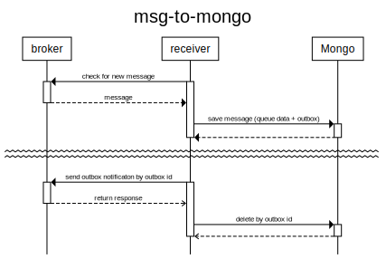
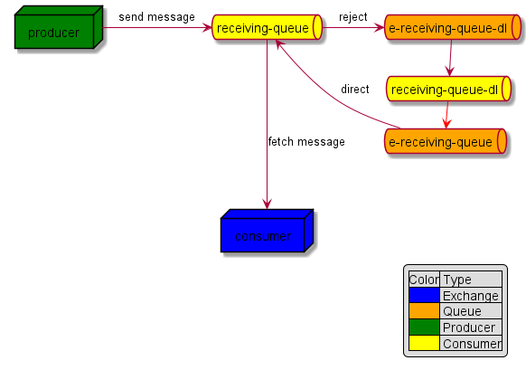

# msg-to-mongo

A simple program convert event from amqp message to mongo db


## Installation
```shell
go install github.com/xh-dev-go/msg-to-mongo@latest
```

## Get dependency
```shell
go get github.com/xh-dev-go/msg-to-mongo@latest
```

## Command
```shell
  -amqp-url string
        The connection string of amqp
  -data-collection string
        The name of collection to store the message
  -mongo-db string
        The name of mongo db
  -mongo-url string
        The connection string of mongodb
  -outbox-collection string
        The name of collection to store the outbox message
  -queue-name string
        The name of queue
  -splitting
        splitting message by new line
  -version
        show application version

```

## Demo
```shell
# data-collection => the collection which store the data
# outbox => the collection which store a time stamp for receiving message

msg-to-mongo \
  --amqp-url {amqp-url} \
  --queue-name {queue-name} \
  --mongo-url {mongo-url} \
  --mongo-db {db-name} \
  --data-collection {data-collection} \
  --outbox-collection {outbox} \
  --splitting
```

# Design
## Sequence flow


## Retry model

